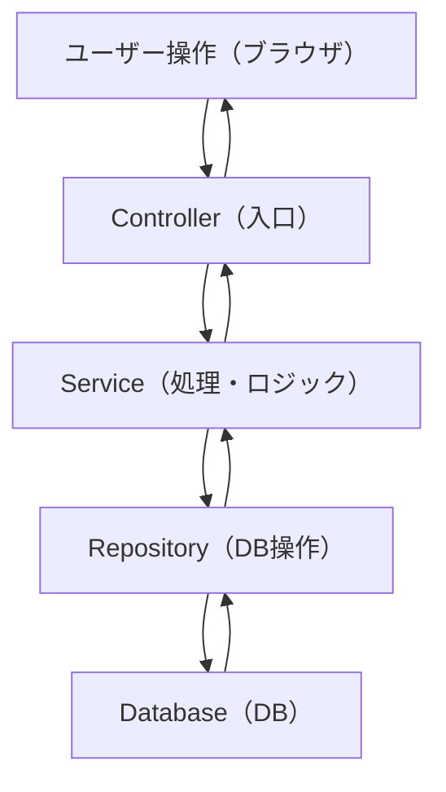

# 全体の処理フロー

## イメージ図


## イメージ
```
① ユーザーが操作する
② API（Controller）が受け取る
③ Serviceが処理する
④ DBに保存/取得する
⑤ 結果を画面に返す
```


## より直感的なイメージ
```
ユーザー
  ↓
「ノード一覧見たい！」

Controller（受付）
  ↓
「一覧くれって来てるよ」

Service（頭脳）
  ↓
「じゃあDBから取ってこよう」

Repository（窓口）
  ↓
「DBからデータ持ってきたよ」

DB（倉庫）

→ 戻る

Service
  ↓
Controller
  ↓
画面
  ↓
ユーザーに表示
```

## Node一覧

### Controller

```java
@Controller
@RequestMapping("/nodes")
public class NodeController {

    private final NodeService nodeService;

    public NodeController(NodeService nodeService) {
        this.nodeService = nodeService;
    }

    @GetMapping
    public String list(Model model) {
        List<Node> nodes = nodeService.findAll();
        model.addAttribute("nodes", nodes);
        return "nodes/list";
    }
}
```

    
### Service

```java
@Service
public class NodeService {

    private final NodeRepository nodeRepository;

    public NodeService(NodeRepository nodeRepository) {
        this.nodeRepository = nodeRepository;
    }

    public List<Node> findAll() {
        return nodeRepository.findAll();
    }
}
```

    
### Repository

```java
@Repository
public interface NodeRepository extends JpaRepository<Node, Long> {
}
```

## 図とコードを対応

### ステップ①（PC→Controller）
```
あなたのPC
↓
ブラウザでアクセス
http://localhost:8080/nodes
```
↓
```java
@GetMapping
public String list(...)
```
---

### ステップ②(Controller→Service)
```java
List<Node> nodes = nodeService.findAll();
```

---

### ステップ③(Service→Repository)
```java
return nodeRepository.findAll();
```

---

### ステップ④(Repository→DB)
```
NodeRepository → DB
```
→SQLが内部で実行される
```java
SELECT * FROM node;
```

---

### ステップ⑤(戻り)
```
DB → Repository → Service → Controller
```

---

### ステップ⑥（画面に渡す）
```java
model.addAttribute("nodes", nodes);
```

---

### ステップ⑦(画面表示)
```java
return "nodes/list";
```

---

### ステップ⑧HTML(画面)
```html
<h1>ノード一覧</h1>

<ul>
  <li th:each="node : ${nodes}">
    <span th:text="${node.title}"></span>
  </li>
</ul>
```
