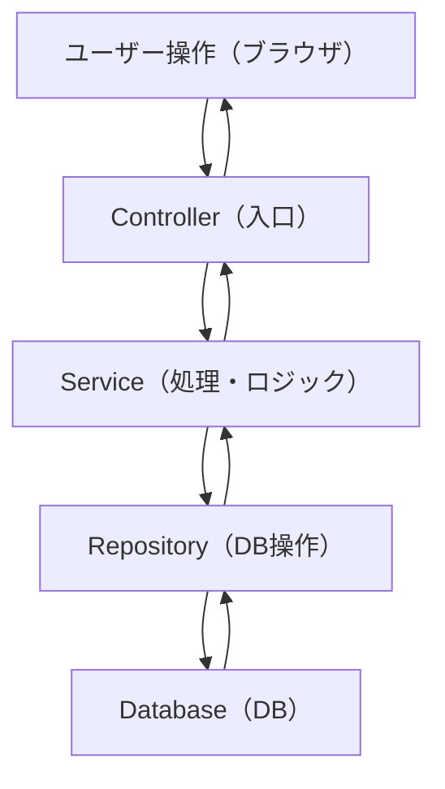

# 全体の処理フロー

## イメージ図


## イメージ
```
① ユーザーが操作する
② API（Controller）が受け取る
③ Serviceが処理する
④ DBに保存/取得する
⑤ 結果を画面に返す
```


## より直感的なイメージ
```
ユーザー
  ↓
「ノード一覧見たい！」

Controller（受付）
  ↓
「一覧くれって来てるよ」

Service（頭脳）
  ↓
「じゃあDBから取ってこよう」

Repository（窓口）
  ↓
「DBからデータ持ってきたよ」

DB（倉庫）

→ 戻る

Service
  ↓
Controller
  ↓
画面
  ↓
ユーザーに表示
```

    
